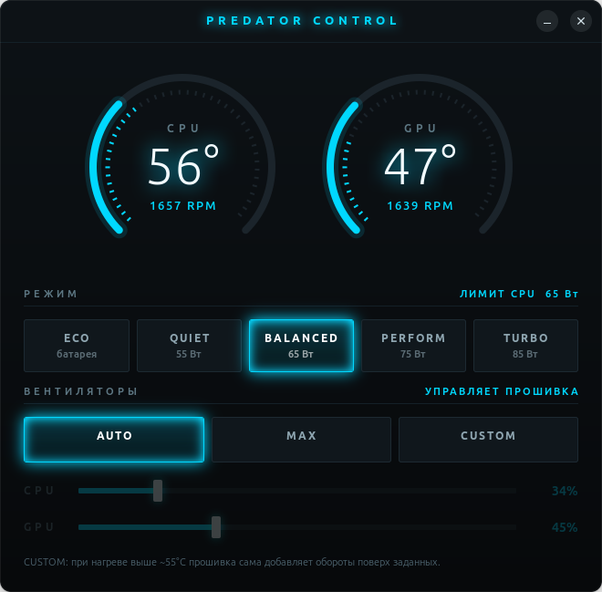

# Predator Control

[English](README.md) | **Русский**

Аналог PredatorSense для Linux: режимы мощности, управление вентиляторами и мониторинг
на ноутбуке **Acer Predator Helios Neo 16S (PHN16S-71)**.



Проверено на одной машине: PHN16S-71, BIOS V1.06, Ubuntu с ядром 7.0.0-31, GNOME на X11.
На других моделях и ядрах не проверялось.

## Что умеет

- **Мониторинг** — температура CPU/GPU и обороты обоих вентиляторов, обновление раз в секунду.
- **Режимы мощности** — Eco / Quiet / Balanced / Performance / Turbo, те же, что в PredatorSense.
- **Вентиляторы** — Auto (управляет прошивка), Max, Custom с отдельными ползунками CPU и GPU (20–100 %).
- Окно (`fan-gui`) и консольная утилита (`fanctl.py`), обе работают без sudo.

## Как это устроено

Штатный драйвер ядра `acer-wmi` уже умеет всё перечисленное, но модели PHN16S-71 нет в его таблице,
поэтому на ней он не показывает даже обороты. В `driver/` лежит `acer-wmi.c` из ядра v7.0 с патчем
[`phn16s-71.patch`](driver/phn16s-71.patch):

1. DMI-запись для `Predator PHN16S-71` с флагами `predator_v4` + `pwm`.
2. Прошивка этой модели до первого выбора режима отдаёт код профиля `0x02`, которого драйвер не знает
   (чтение `platform_profile` падало с `EOPNOTSUPP`). При загрузке драйвер в этом случае выбирает Balanced.

Модуль ставится через DKMS и пересобирается при обновлении ядра. Приложение работает со стандартными
файлами sysfs: `hwmon/*/pwm{1,2}`, `pwm{1,2}_enable`, `fan*_input`, `temp*_input` и
`platform-profile/*/profile`. Udev-правило даёт группе `sudo` право записи в них.

## Установка

Нужны: заголовки текущего ядра, `gcc`, `make`, `dkms`, [`uv`](https://docs.astral.sh/uv/),
системные GTK4 + libadwaita с PyGObject (в Ubuntu с GNOME уже есть). Secure Boot выключен
(иначе модуль придётся подписывать).

```bash
sudo ./install.sh     # драйвер (DKMS) + udev-правило, перезагружает acer_wmi
./install-user.sh     # ярлык «Predator Control», иконка и хук gamemode
```

В конце `install.sh` должен напечатать путь модуля в `updates/dkms`, права `rw-rw-r-- root sudo`
на `pwm*` и `profile` и текущий режим.

## Использование

Окно: «Predator Control» в меню приложений или `./fan-gui`.

```bash
uv run fanctl.py                  # состояние
uv run fanctl.py profile quiet    # eco | quiet | balanced | performance | turbo
uv run fanctl.py set 40           # вентиляторы вручную, 20-100 %
uv run fanctl.py set 60 --fan gpu
uv run fanctl.py max
uv run fanctl.py auto
```

Окно при закрытии ничего не сбрасывает: выбранный режим остаётся до перезагрузки.

### Автоматический режим для игр

Сам по себе режим мощности не переключается. Если установлен [gamemode](https://github.com/FeralInteractive/gamemode),
`install-user.sh` кладёт `~/.config/gamemode.ini` (если его ещё нет) с хуком `tools/gamemode-profile.sh`:
при запуске игры включается Performance, после выхода возвращается прежний режим. Другой режим задаётся
вторым аргументом в `gamemode.ini`: `...gamemode-profile.sh start balanced`.
В Steam: свойства игры → параметры запуска → `gamemoderun %command%`.

## Что измерено на этой машине

| Режим | PredatorSense | PL1 (от сети) |
|---|---|---|
| `low-power` | Eco | 65 Вт (от сети не отличается от Balanced) |
| `quiet` | Quiet | 55 Вт |
| `balanced` | Balanced | 65 Вт |
| `balanced-performance` | Performance | 75 Вт |
| `performance` | Turbo | 85 Вт |

PL2 во всех режимах 140 Вт с окном 56 с — короткие нагрузки от режима не зависят.

Полная нагрузка на все ядра, 130 с, вентиляторы в Auto, среднее за 70–128 с:

| | Balanced | Turbo |
|---|---|---|
| Частота | 3177 МГц | 3239 МГц (+2 %) |
| Температура CPU | 96 °C | 103–105 °C |
| Вентиляторы | ~3130 об/мин | ~4810 об/мин |

Процессор в обоих режимах упирается в температуру, а не в лимит мощности; Turbo поднимает
температурный потолок. Замер в игре - в разделе про Dynamic Boost.

Особенности прошивки (EC):

- Проценты в Custom — не абсолютная скорость. Когда датчик вентилятора теплее ~55 °C, EC добавляет
  обороты поверх заданных: 50 % дают ~2400 об/мин в холодном состоянии и ~3200 в тёплом.
  Перегреть машину ползунком нельзя.
- Ниже 20 % вентиляторы близки к срыву (15 % — 500–700 об/мин), поэтому диапазон 20–100 %.
  Останавливает вентиляторы в простое только режим Auto.
- Штатная кривая Auto ленивая: под нагрузкой до 3100 об/мин вентиляторы доходят за ~40 с.

## Dynamic Boost для видеокарты

У RTX 5070 Laptop лимит мощности по умолчанию 70 Вт при максимуме 115 Вт;
поднимает его демон `nvidia-powerd` (Dynamic Boost). Прошивка сообщает
`Notebook Dynamic Boost: Supported`, но Ubuntu демон не включает и не ставит его политику D-Bus.

- `nvidia/nvidia-dbus.conf` — политика D-Bus из официальной поставки NVIDIA (взята из Debian-пакета `nvidia-powerd`).
- `sudo nvidia/install-powerd.sh` — включить демон постоянно (политика D-Bus + штатный systemd-юнит NVIDIA); `... remove` — убрать.
- `sudo nvidia/try-powerd.sh` — включить демон временно, до перезагрузки; `... stop` — отменить.
- `tools/gpu_bench.sh` — замер GPU под нагрузкой (Vulkan-шейдер через `wgpu`, без root), останавливается при GPU > 87 °C.

Замер: 70 с нагрузки, режим Balanced, значения после выхода в P0 (первые ~20 с драйвер держит карту
в P4, 19 Вт, независимо от режима Acer):

| | без демона | с `nvidia-powerd` |
|---|---|---|
| Лимит мощности GPU | 70 Вт | 85 Вт |
| Потребление | 66–67 Вт | 65–66 Вт |
| Частота | 2790 МГц | 2805 МГц |
| Температура GPU | 68 °C | 64 °C |
| Скорость | 9,7 прохода/с | 9,6 прохода/с |

Лёгкий шейдер (`light`) сам потребляет только ~65 Вт и в лимит не упирается. Нагрузка `heavy`
(`tools/gpu_bench.sh 50 heavy`, случайные чтения из памяти) упирается в лимит мощности, режим Balanced:

| `heavy` | без демона | с `nvidia-powerd` |
|---|---|---|
| Лимит / потребление | 70 / 69,9 Вт | 85 / 84,8 Вт (+21 %) |
| Частота | 2300–2380 МГц | 2625–2655 МГц (+12 %) |
| Температура GPU за 50 с | 65 °C | 68 °C |
| Скорость | 1,26–1,29 прохода/с | 1,32–1,33 прохода/с (+5 %) |

С демоном лимит GPU зависит от режима Acer (нагрузка `heavy`, 40 с):

| Режим | Лимит GPU | Потребление | Частота | GPU | Скорость |
|---|---|---|---|---|---|
| без демона, любой | 70 Вт | 70 Вт | 2300–2380 МГц | 65 °C | 1,27 прохода/с |
| Balanced | 85 Вт | 85 Вт | 2625–2655 МГц | 68 °C | 1,33 (+5 %) |
| Performance | 100 Вт | 90–91 Вт | 2790 МГц | 63 °C | 1,38 (+9 %) |
| Turbo | 115 Вт | 92–93 Вт | 2780 МГц | 68 °C | 1,38 (+9 %) |

Эта нагрузка берёт не больше ~93 Вт, поэтому Performance и Turbo на ней равны; она ограничена ещё
и памятью, так что прирост скорости меньше прироста частоты (+20 %). Игры не измерялись.
Автозапуск демона после перезагрузки ещё не проверен.

Dynamic Boost делит общий бюджет мощности между CPU и GPU: когда сильно нагружен процессор, лимит GPU
опускается, в том числе ниже штатных 70 Вт. Замер в реальной игре (Path of Exile 2, ~6 ядер CPU, FPS ограничен
100 Гц монитора, вентиляторы Auto):

| | Performance | Balanced |
|---|---|---|
| CPU | 105 °C, троттлинг | 97–99 °C |
| Вентиляторы | ~4460 об/мин | ~3190 об/мин |
| Лимит GPU (с демоном) | 70 Вт | 55 Вт |
| FPS | 100 | 100 |

Для игр, нагружающих процессор, при ограниченном FPS выгоднее Balanced: тот же FPS, холоднее и тише.

## Ограничения и непроверенное

- После перезагрузки драйвер поднимается сам (Balanced, вентиляторы в Auto). Взаимодействие
  с `power-profiles-daemon` (он пишет в тот же `platform_profile`) не проверялось.
- Плитки вентиляторов в окне не отслеживают смену режима извне (режим мощности — отслеживают).
- Подсветки клавиатуры нет: в `acer-wmi` её интерфейса нет.
- Если DKMS не соберёт модуль под новое ядро, загрузится штатный драйвер: вентиляторы останутся
  в Auto, приложение сообщит, что устройство не найдено.

## Удалени

```bash
sudo dkms remove acer-wmi-phn16s/1.1 --all
sudo rm -rf /usr/src/acer-wmi-phn16s-1.1 /etc/udev/rules.d/90-acer-fan.rules
sudo modprobe -r acer_wmi && sudo modprobe acer_wmi
rm ~/.local/share/applications/predator-control.desktop ~/.local/share/icons/hicolor/scalable/apps/predator-control.svg
rm ~/.config/gamemode.ini   # если его создал install-user.sh
```

## Лицензия

`driver/acer-wmi.c` — код ядра Linux, GPL-2.0-or-later. Остальное — на тех же условиях.
Проект не связан с Acer; логотипы и графика Acer не используются.
